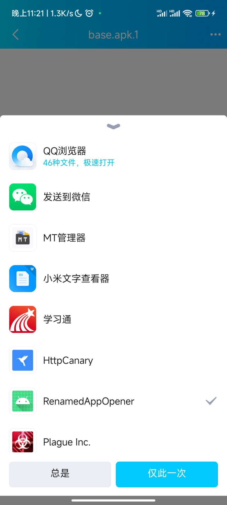

# RenamedAppOpener

## 一. 为什么存在

众所周知，从QQ上下载文件时，会**自动的**加上.1后缀，令不会操作文件管理器的萌新头疼至极

为简化群u重命名的功夫，本工具应运而生。

## 二. 使用教程

1. 下载软件，安装。

   > 本软件无任何界面，卸载请前往`设置`——`应用`

2. 在qq中下载.1为后缀的文件，选择`用其他应用打开`

   

3. 找到`RenamedAppOpener`，选择`总是`

   

4. 在接下来的弹框中选择`允许`

   

5. 安装apk

## 三. 数据清理

安装的文件不会被默认删除。

请前往应用的设置页面清理数据。